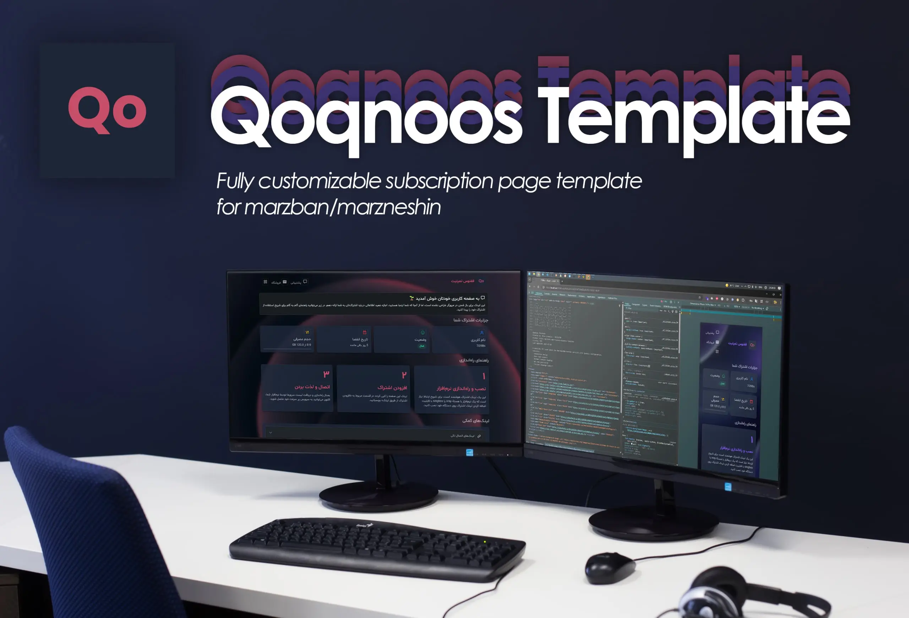

# Qoqnoos Template


A beautiful RTL user panel template for Marzban/Marzneshin services with dynamic configuration. Inspired by [Marzbanify Template](https://github.com/dermv/marzbanify-template)

[](https://github.com/rezazoom/qoqnoos-template/blob/main/LICENSE)
[](https://github.com/rezazoom/qoqnoos-template/stargazers)
[](https://github.com/rezazoom/qoqnoos-template/network/members)
[](https://github.com/rezazoom/qoqnoos-template/issues)
[](https://github.com/rezazoom/qoqnoos-template/commits/main)

## Features

- 🌙 Dark mode support
- 📱 Fully responsive design
- 🎨 Customizable color scheme and branding
- 🔗 Dynamic content loading
- 📊 Traffic usage visualization
- 📱 QR code generation for easy setup
- 🚀 Ready-to-use configuration
- 🇮🇷 Persian (Farsi) language support
- 🛠️ Easy to customize and extend

## Preview



## Installation

### 1. Upload the template file to the server

Choose the version and run the corresponding command.

**Marzneshin version:**
```
sudo wget -O /var/lib/marzneshin/templates/subscription/index.html https://raw.githubusercontent.com/rezazoom/qoqnoos-template/main/index-marzneshin.html
```

### 2. Configure the subscription page path

**Automatically**

**Manually**

Edit the marzneshin `.env` file and add the following lines:
```
CUSTOM_TEMPLATES_DIRECTORY="/var/lib/marzneshin/templates/"
SUBSCRIPTION_PAGE_TEMPLATE="subscription/index.html"
```

### 3. Restart marzneshin

Apply the changes by restarting Marzban:
```
marzneshin restart
```


## Configuration

The template is highly configurable through the JavaScript configuration object:

```javascript
const config = {
    siteName: "My VPN Service",
    logoUrl: "https://example.com/logo.png",
    primaryColor: "#c64e69",
    backgroundImage: "https://example.com/background.jpg",
    supportLink: "https://t.me/supportlink",
    shopLink: "https://example.com/shop",
    welcomeMessage: {
        enabled: true,
        title: "Welcome to our service",
        content: "Your welcome message here..."
    },
    downloadLinks: [
        {
            icon: "bx bxl-android",
            name: "Android App",
            url: "https://play.google.com/store/apps/details?id=com.example.app"
        }
        // Add more download links as needed
    ]
};
```

## Customization

### Colors
Edit the CSS variables in the `<style>` section to change the color scheme:

```css
:root {
    --primary: #c64e69;
    --success: #34d399;
    --warning: #fbbf24;
    --danger: #f87171;
    --gray: #9ca3af;
    --bg-dark: #111827;
    --bg-darker: #0f172a;
    --card-dark: #1e293bcc;
    --text-light: #f8fafc;
    --text-lighter: #e2e8f0;
}
```
## Dependencies

This template uses the following external resources:

- [Bootstrap 5 RTL](https://cdn.jsdelivr.net/npm/bootstrap@5.3.0/dist/css/bootstrap.rtl.min.css)
- [Shabnam Font](https://github.com/rastikerdar/shabnam-font)
- [Boxicons](https://boxicons.com/)
- [QRCode.js](https://davidshimjs.github.io/qrcodejs/)

## License

This project is licensed under the MIT License - see the [LICENSE](LICENSE) file for details.

## Contributing

Contributions are welcome! Please open an issue or submit a pull request.
